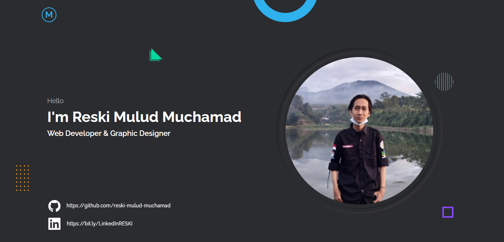

# Hi Folks! 

&nbsp;
&nbsp;
&nbsp;
&nbsp;
&nbsp;

## I am [Reski Mulud Muchamad](https://reskimulud.my.id), 
A Software Developer and Graphic Designer. I am an _undergraduate student_ at the [Universitas Muhammadiyah Sukabumi](https://ummi.ac.id) and taking the Informatics Engineering study program and I am currently taking semester 6.

### About Me :
-  [**Google Developer Student Clubs**](https://gdsc-ummi.tech) *Lead* at *Universitas Muhammadiyah Sukabumi*
-  **Mobile Developer Student** at [*Bangkit Academy 2022 by Google, GoTo, Traveloka*](https://g.co/bangkit)

I am a person who really likes new things, and feel challenged about it. I really enjoy exploring and seeking knowledge in the world of computers, gadgets and programming, that's the reason I chose to study Informatics Engineering.

I feel that what my campus teaches is not enough, therefore I continue to seek knowledge outside of lectures, and that is my daily activity.

- 👀 I’m interested in Algorithm, Web Development, Mobile Application, Machine Learning
- 🌱 I’m currently learning about Mobile Apps (Android) and Machine Learning
- 💬 Feel free to ask me about web development or anything
- 📫 How to reach me: [reski.mulud@gmail.com](mailto:reski.mulud@gmail.com)

## 🙋‍♂️ Social
  &nbsp;
  &nbsp;
  &nbsp;
  &nbsp;
  &nbsp;
  &nbsp;
  &nbsp;
  &nbsp;
  

# Tech Stack
  &nbsp;
  &nbsp;
  &nbsp;
  &nbsp;
  &nbsp;
  &nbsp;
  &nbsp;
  &nbsp;

  &nbsp;
  &nbsp;
  &nbsp;

  &nbsp;
  &nbsp;

# 📈 Github Statistic 

  

